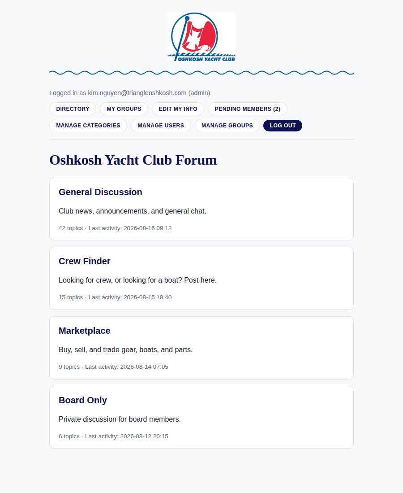
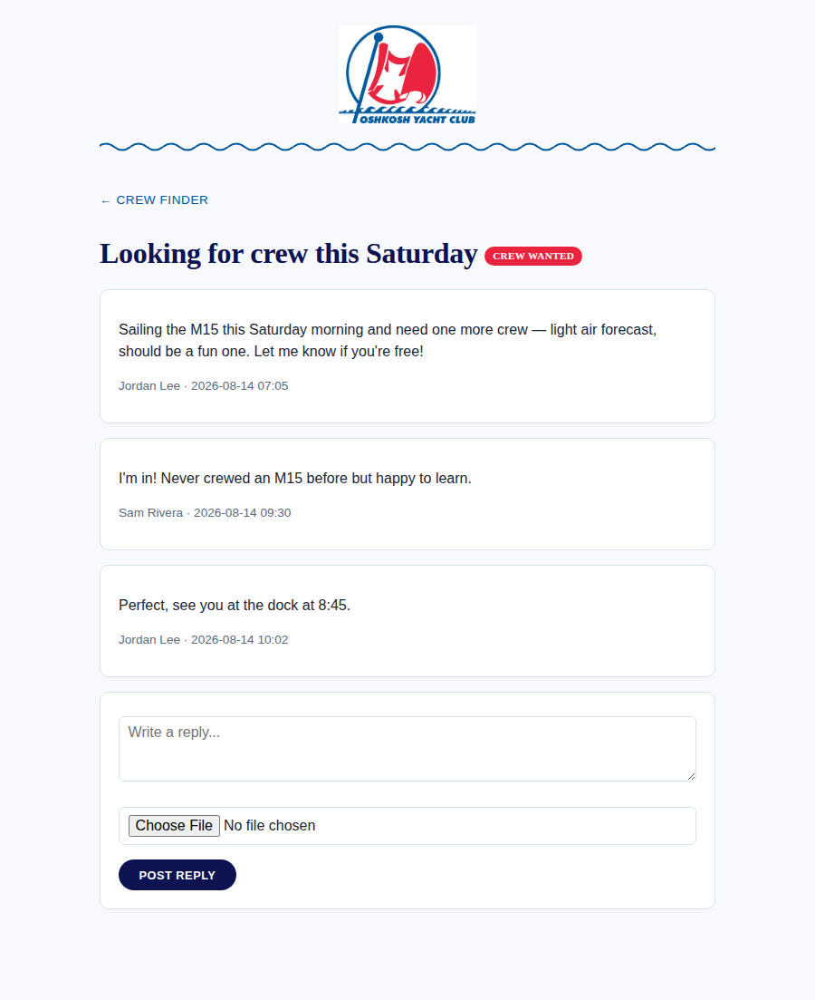
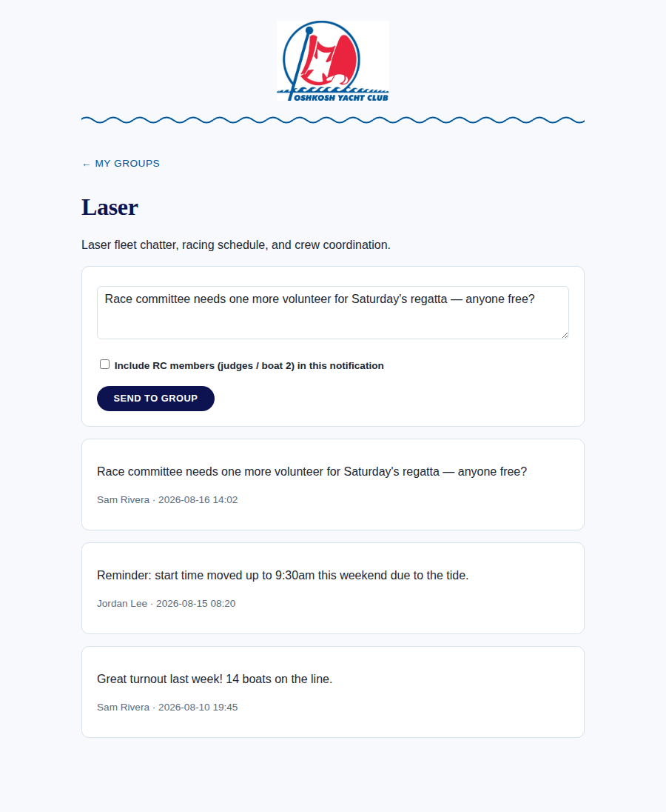
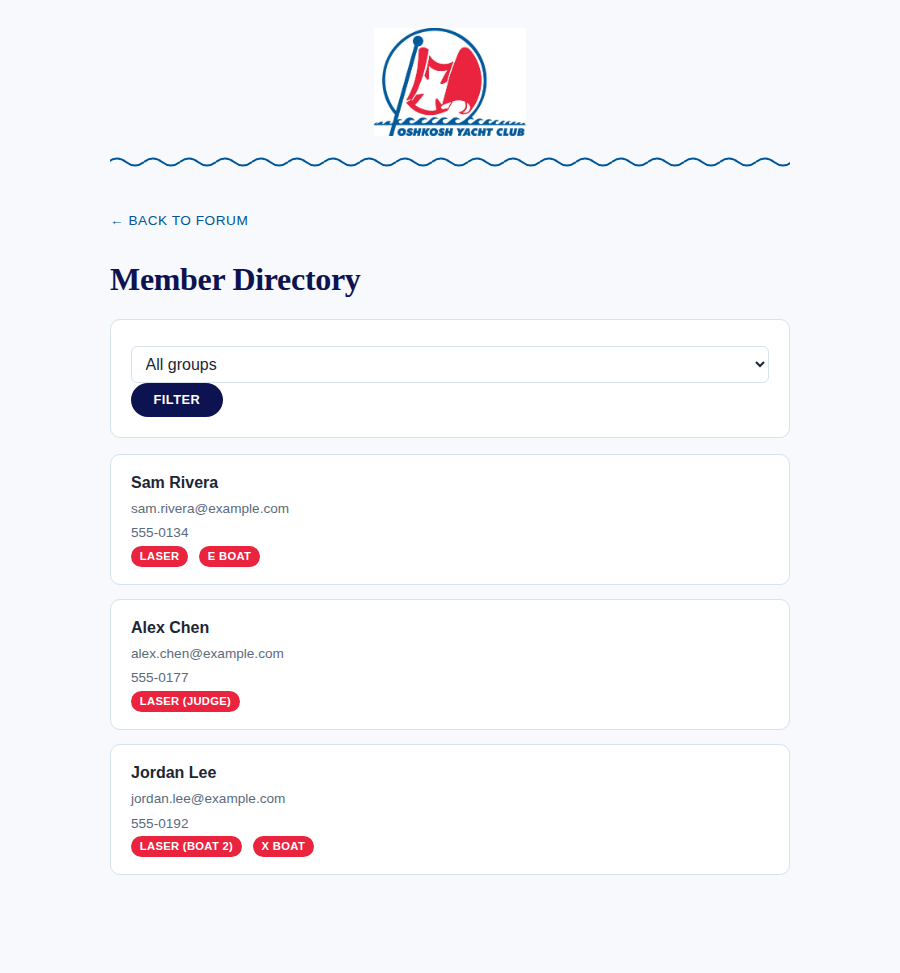
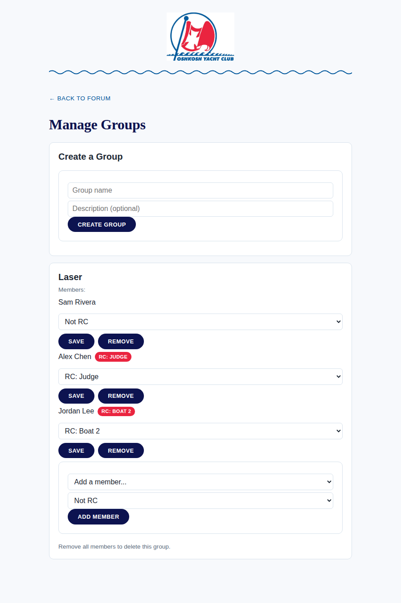

<!-- _class: lead -->

# OYC Forum

A private member forum and club portal for the
**Oshkosh Yacht Club**

Built on Astro + Cloudflare Workers, D1, and R2

---

## What it is

- A members-only forum with **magic-link login** — no passwords
- Categories, topics, and replies, with photo/file attachments
- A club **member directory** with fleet groupings
- **Group messaging** for fleets (E Boat, Opti, Laser, M15, X Boat), delivered by email and/or SMS
- A full **admin control panel** — no manual database commands required day-to-day

---

## Tech stack

| Layer | Choice |
|---|---|
| Framework | Astro (server-rendered) |
| Hosting | Cloudflare Workers |
| Database | Cloudflare D1 (SQLite) |
| File storage | Cloudflare R2 |
| Email | Resend |
| SMS | Twilio |

No servers to manage — the whole app deploys as a single Cloudflare Worker.

---

## The forum, themed

Real Oshkosh Yacht Club branding: logo, blue (`#00569b`) and red (`#ea243f`)
pulled directly from the club's own materials.



---

## Sign-in, without passwords

- Enter your email → get a one-time **magic link** (60-minute expiry)
- Click it → you're in, session lasts 30 days
- New accounts start **pending** until an admin approves them
- Roles: `guest` &rarr; `member` &rarr; `moderator` &rarr; `board` &rarr; `admin`
- Categories can require a minimum role to view *or* post — e.g. a **Board Only** category only board members and admins can see

---

## Posting & categories

- Categories: General Discussion, Crew Finder, Marketplace, Board Only, and more
- Topics can carry a tag like <span class="tag">Crew Wanted</span> or Buy/Sell/Trade
- Replies support photo and file attachments, stored in Cloudflare R2
  and served back out only to people with access to that category



---

## Fleet groups

Members can belong to one or more **groups** — the club's boat fleets:
E Boat, Opti, Laser, M15, X Boat (more can be added any time).

Each group has its own private message board:



---

## Group messages, delivered your way

- Post a message → everyone in the group sees it, newest first
- Each member chooses **email and/or SMS** for group message notifications
  (from their own "Edit My Info" page)
- **Race Committee (RC)** members — judges or boat 2 — can be excluded
  from routine group notifications by default, with a checkbox to
  include them when a message really is for RC too

---

## Reply notifications

- Reply to a topic → everyone else already in that thread (the original
  poster plus anyone who's replied) gets notified
- Same per-user email/SMS preference model as group messages
- No inbox to check obsessively — the forum comes to you

---

## Member directory

Every approved member, their contact info, and which fleets (and RC
duty) they're part of — filterable by group.



---

## The admin control panel

No more hand-written SQL for routine club administration:

- **Manage Categories** — enable/disable, edit descriptions
- **Manage Users** — approve members, change roles, edit contact info
- **Manage Groups** — create fleets, add/remove members, assign RC duty
- **CSV export & import** — bulk-manage the whole roster, including
  group memberships, RC assignments, and notification preferences



---

## Bulk roster management via CSV

Export the whole membership to a spreadsheet, edit it, re-import:

```
email, name, phone, role, approved, groups,
notify_group_email, notify_group_sms,
notify_replies_email, notify_replies_sms
```

- `groups` column: `E Boat;Laser:judge` — semicolon-separated,
  `:judge` / `:boat2` marks Race Committee duty
- Only columns present in the file get updated — a partial CSV never
  silently wipes fields you didn't intend to touch
- A downloadable template keeps the format easy to follow

---

## Security model, in short

- Every access check happens **server-side**, on every request —
  not just hidden in the UI
- Sessions are cookie-based, `httpOnly`, and `Secure` only over HTTPS
  (tuned specifically for Safari's stricter cookie rules)
- Admin routes and admin API endpoints independently verify the
  caller's role before doing anything
- Attachments are streamed through an access-checked endpoint, not
  served as public files

---

<!-- _class: lead -->

# Questions?

Built iteratively, one feature request at a time —
this deck itself was generated the same way.
